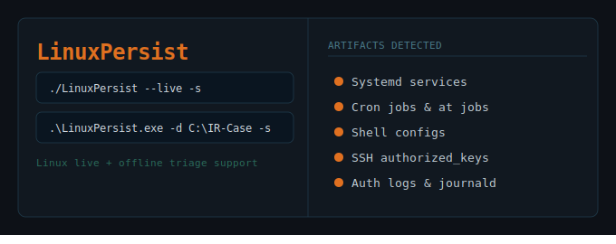

<p align="center">
  
</p>

# LinuxPersist

**LinuxPersist** is a forensic tool for detecting Linux persistence artifacts across live systems and offline triage collections. Built for DFIR and designed to work with any Linux triage output, it supports flexible export formats and includes a live system scan mode for forensic investigation.

## Features

- Detects **shell configs**, **systemd services**, **cron jobs**, **SSH keys**, **auth logs**, **rc.local**, **APT hooks**, and more.
- Exports results as **TXT**, **JSON**, or **CSV**.
- **Live scan mode** (`--live`) - scans a live Linux system for persistence artifacts.
- **Offline triage mode** (`-d`) - scans any Linux triage folder for persistence artifacts.
- Available as a **standalone executable** for Linux and Windows.

## Download

| Platform | Download |
|----------|----------|
| Linux    | [LinuxPersist_Linux.7z](./LinuxPersist_Linux.7z) |
| Windows  | [LinuxPersist_Windows.7z](./LinuxPersist_Windows.7z) |

## Linux Compatibility

The Linux executable was built for **x86_64 glibc-based systems**.

Tested on:
- REMnux
- Kali Linux

Expected to work on:
- Debian/Ubuntu/Kali-based systems with **glibc 2.31 or newer**

Not guaranteed on:
- Older Linux distributions
- ARM systems

If the Linux binary does not run, check your glibc version with:

```bash
ldd --version
```

## Installation and Usage

### Linux

- Extract the `.7z` archive:
  ```bash
  7z x LinuxPersist_Linux.7z
  ```
- Grant executable permission:
  ```bash
  chmod +x LinuxPersist
  ```
- Run:
  ```bash
  ./LinuxPersist --help
  ```

---

### Windows

- Extract the `.7z` archive.
- Open **Command Prompt** or **PowerShell** in the folder where the executable is located.
- Run:
  ```
  .\LinuxPersist.exe --help
  ```

---

## Flags

| Flag | Description |
|------|-------------|
| `--live` | Live scan of the local Linux system *(Linux only)* |
| `-d <PATH>` | Offline triage folder |
| `-s` | Start the scan *(required)* |
| `--txt` | Save output as plain text (`.txt`) |
| `--json` | Save output as JSON (`.json`) |
| `--csv` | Save output as CSV (`.csv`) |
| `-o <DIR>` | Custom output directory *(default: `~/Desktop/LinuxPersist_Results/`)* |
| `-h, --help` | Show help message |

---

## Modes

### Live Scan - Linux Only

Scan the local Linux system for persistence artifacts:

```bash
./LinuxPersist --live -s
```

For full access to system-level artifacts, run with elevated privileges:

```bash
sudo ./LinuxPersist --live -s
```

Export findings:

```bash
sudo ./LinuxPersist --live -s --txt --json --csv
```
Save to a custom output folder:

```bash
sudo ./LinuxPersist --live -s --csv -o ~/results
```

---

### Offline Triage

> For best results, use with a [UAC](https://github.com/tclahr/uac) triage collection. UAC preserves the full Linux filesystem structure and provides the most complete artifact coverage.

Scan any Linux triage folder:

```bash
./LinuxPersist -d /triage/IR-Case -s
```

Export findings:

```bash
./LinuxPersist -d /triage/IR-Case -s --txt --json --csv 
```

Save to a custom output folder:

```bash
./LinuxPersist -d /triage/IR-Case -s --csv -o ~/results
```

Windows:

```
.\LinuxPersist.exe -d C:\triage\IR-Case -s --csv -o C:\results
```

---

## Output

- **TXT** - human-readable output matching the terminal display, one finding per artifact block.
- **JSON** - structured output with tool metadata, scan mode, scan target, and all findings.
- **CSV** - one row per finding with columns: `User`, `Artifact`, `Path`, `Finding`, `Reason`.

---

## Artifacts Scanned

| Category | Artifacts |
|----------|-----------|
| Shell Configs | `.bashrc` `.profile` `.bash_profile` `.zshrc` `/etc/bash.bashrc` `/etc/environment` |
| SSH | `authorized_keys` |
| Cron | `/etc/cron.*` `/var/spool/cron` `crontab` |
| At Jobs | `/var/spool/cron/atjobs` `/var/spool/at` |
| Systemd | `.service` `.timer` (system + user level) |
| Auth Logs | `auth.log` `secure` `journald` (live + offline) |
| Boot / Init | `rc.local` `/etc/init.d` `/etc/update-motd.d` |
| Profile | `/etc/profile.d/*.sh` |
| Preload | `/etc/ld.so.preload` |
| Autostart | `~/.config/autostart` `/etc/xdg/autostart` |
| Network | `/etc/NetworkManager/dispatcher.d` |
| APT Hooks | `/etc/apt/apt.conf.d` |

---

## Important Notice

Some antivirus software may flag the executable as a false positive. This is due to the way the tool is packaged using **Python** and **PyInstaller**, which can sometimes trigger heuristic detections.

If you encounter warnings, consider:

- Running the tool in a sandbox or isolated environment.
- Adding an exclusion rule for the executable in your antivirus software.
- Temporarily disabling your antivirus software.

---

## Contact

For questions or feedback, contact me via https://www.linkedin.com/in/guy-eldad/

---

*Copyright © 2026 Guy Eldad. All rights reserved.*
